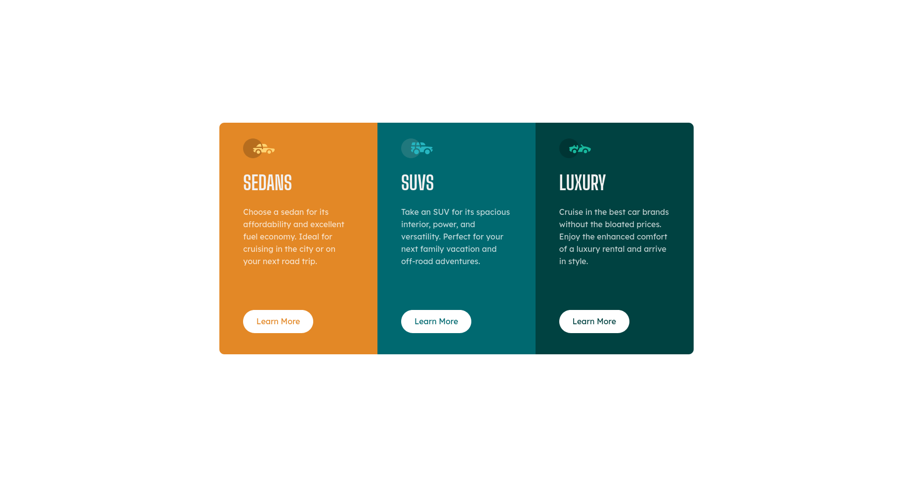

# Frontend Mentor - 3-column preview card component solution

This is a solution to the [3-column preview card component challenge on Frontend Mentor](https://www.frontendmentor.io/challenges/3column-preview-card-component-pH92eAR2-). Frontend Mentor challenges help you improve your coding skills by building realistic projects.

## Table of contents

- [Overview](#overview)
  - [The challenge](#the-challenge)
  - [Screenshot](#screenshot)
  - [Links](#links)
- [My process](#my-process)
  - [Built with](#built-with)
  - [What I learned](#what-i-learned)
  - [Useful resources](#useful-resources)
- [Author](#author)

## Overview

### The challenge

Users should be able to:

- View the optimal layout depending on their device's screen size
- See hover states for interactive elements

### Screenshot

- Desktop view
  
- Mobile view
  

### Links

- Solution URL: [Add solution URL here](https://your-solution-url.com)
- Live Site URL: [Add live site URL here](https://your-live-site-url.com)

## My Process

### Built with

- Semantic HTML5 markup
- CSS custom properties
- Flexbox
- CSS Grid
- Mobile-first workflow

### What I learned

Learn about writing clean Html architecture and structure the css file
Learn about media queries and CSS grid as a way to make a responsive layout

To see how you can add code snippets, see below:

```css grid
section {
  ...,
  grid-template-columns: repeat(3, 1fr);
}
```

```css media queries
@media (max-width: 716px) {
  section {
    grid-template-columns: 1fr;
  }

  .first {
    border-radius: 10px 10px 0 0;
  }

  .third {
    border-radius: 0 0 10px 10px;
  }

  .card {
    max-width: 274.5px;
    height: 430px;
    min-width: 200px;
  }
}
```

<!-- ### Useful resources

- [Example resource 1](https://www.example.com) - This helped me for XYZ reason. I really liked this pattern and will use it going forward.
- [Example resource 2](https://www.example.com) - This is an amazing article which helped me finally understand XYZ. I'd recommend it to anyone still learning this concept. -->

## Author

- Website - [Add your name here](https://www.your-site.com)
- Frontend Mentor - [@Dodolight](https://www.frontendmentor.io/profile/Dodolight)
- Twitter - [@Donan82838492](https://www.twitter.com/Donan82838492)
